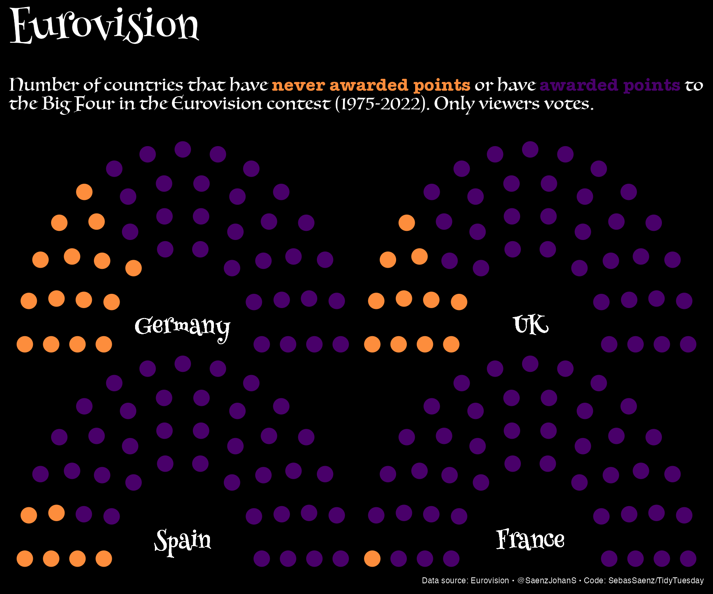

# 30DayChartChallenge

Collection of contributions to the [#30DayChartChallenge](https://github.com/30DayChartChallenge/Edition2024?tab=readme-ov-file)

## 2024

Day 1: Part-to-Whole

Germany, the UK, France and Spain are known as the "Big four" in the Eurovision Song Contest. However, they have never been voted for by the public in some countries.

#30DayChartChallenge | Day 5: Diverging  

El lateral Delvin Alfonzo y el central Andrés Llinas son los jugadores de 
@MillosFCoficial ⚽️ que mas minutos han jugado comparado al promedio del equipo (15 Partidos). 
@losmillonarios

Data source: FBREF

